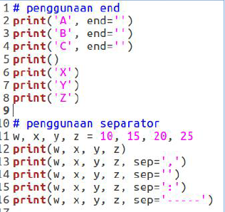
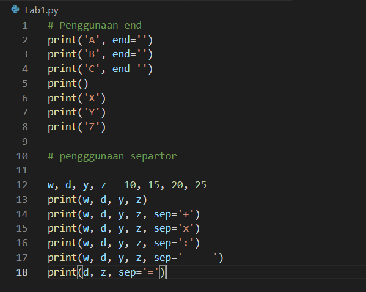
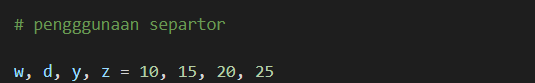
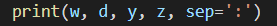
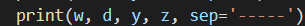
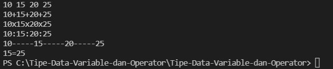

# Tipe-Data-Variable-dan-Operator
Nama        : Bagas Ari Pradana

Kelas       : TI.21.C5

Nim         : 312110485

Matkul      : Bahasa Pemrograman

## Lab1

Pada halaman ini (Tugas pertemuan 6 - lab 1) Saya di berikan tugas oleh Dosen yaitu mempelajari Operator Aritmatika menggunakan bahasa pemograman python. Berikut source yang di berikan oleh Dosen

Oke, kali ini saya menjelaskan materi yang dijelaskan oleh Dosen. 

### Penggunaan END Penggunaan end digunakan untuk menambahkan kata yang dicetak di akhir baris

Penggunaan print() digunakan untuk mencetak output, Syntax dibawah ini digunakan untuk menampilkan output berupa string

### Hasil dari source code terseut seperti gambar di bawah ini: 

### Pengertian separaktor Sepaktor adalah pemisah yang berfungsi sebagai tanda pemisah antar objek yang dicetak. Defaultnya adalah tanda sepasi

Pendeklarasian beberapa variable berserta nilainya

Menampilkan hasil setiap variable tiap-tiap variable

Menampilkan hasil variable dari tiap-tiap variable menggunakan pemisah , (koma)

Menampilkan hasil variable dari tiap-tiap variable dengan menggunakan pemisah ----

### Hasil dari syntax / source code diatas adalah seperti berikut ini:

