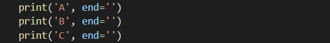
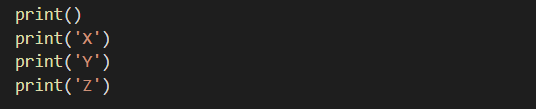
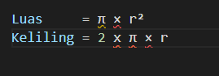

# Tipe-Data-Variable-dan-Operator
Nama        : Bagas Ari Pradana

Kelas       : TI.21.C5

Nim         : 312110485

Matkul      : Bahasa Pemrograman

## Lab1

Pada halaman ini (Tugas pertemuan 6 - lab 1) Saya di berikan tugas oleh Dosen yaitu mempelajari Operator Aritmatika menggunakan bahasa pemograman python. Berikut source yang di berikan oleh Dosen

Oke, kali ini saya menjelaskan materi yang dijelaskan oleh Dosen. 

### Penggunaan END Penggunaan end digunakan untuk menambahkan kata yang dicetak di akhir baris

Penggunaan print() digunakan untuk mencetak output, Syntax dibawah ini digunakan untuk menampilkan output berupa string

### Hasil dari source code terseut seperti gambar di bawah ini: 

### Pengertian separaktor Sepaktor adalah pemisah yang berfungsi sebagai tanda pemisah antar objek yang dicetak. Defaultnya adalah tanda sepasi

Pendeklarasian beberapa variable berserta nilainya

Menampilkan hasil setiap variable tiap-tiap variable

Menampilkan hasil variable dari tiap-tiap variable menggunakan pemisah , (koma)

Menampilkan hasil variable dari tiap-tiap variable dengan menggunakan pemisah ----

### Hasil dari syntax / source code diatas adalah seperti berikut ini:

## Lab1-2

String format
String formatting atau pemformatan string memungkinkan kita menyuntikkan item kedalam string daripada kita mencoba menggabungkan string menggunakan koma atau string concatenation.Penggunaan pada source yang di berikan Dosen sebagai berikut : 

Saat ini saya akan menjelaskan satu persatu dari syntax yang diberikan oleh Dosen 

### 1.String format 1
Pada syntax / source code string format 1 akan menampilkan output berupa 2 outputan.
Yang pertama (sebelah kiri) akan menampilkan angka urut dari angka 0 hingga 10, sedangkan sebelah kanan akan menampilkan Oprasi Aritmatika Pangkat.
Dengan ketentuan sebagau berikut, oprasi pangkat dengan angka kiri sebagai pokok (Rumus : ** [Bintang dua])
Hasil dari syntax tersebut adalah 10 pangkat 0, hingga 10 pangkat 10. Dengan output sebagai berikut : 

### 2.String format 2
Pada syntax / source code string format 2 akan menampilkan output berupa 2 output'an juga (Seoerti string format 1, yaitu kanan dan kiri)

## Lab 2

### Konversi Nilai Variable Untuk pembahasan terakhir, kali ini akan myenyelesaikan tugas Lab 2 dari Dosen, yaitu Konversi Nilai Variable
Tugas yang di berikan oleh Dosen adalah seperti gambar dibawah ini 

### Program yang saya buat 

Hasil Outputnya:

# Tugas Latihan

## Rumus Luas & Keliling Lingkaran

    Nilai Phi yang akan kita gunakan adalah 3.14
    r merupakan jari-jari lingkaran

Phi merupakan nilai konstanta di matematika sementara jari-jari merupakan jarak antara titik pusat dengan tepi lingkaran. Sebetulnya ada rumus lain untuk menghitung keliling lingkaran yaitu dengan menggunakan diameter, tapi pada kasus ini kita cukup menggunakan jari jari lingkaran saja.

## Flowchart Menghitung Luas & Keliling Lingkaran

## Program Python Menghitung Luas & Keliling Lingkaran

## Output:

## Penjelasan 

untuk mengambil 2 angka pecahan saja kita pakai fungsi format() seperti berikut:

Dengan penggunaan fungsi format(luas,’.2f’) akan menghasilkan 2 angka pecahan saja.

================= TAHNKS =================

    BAGAS ARI PRADANA / 312110485 / TI.21.C5

=================☕☕☕=================